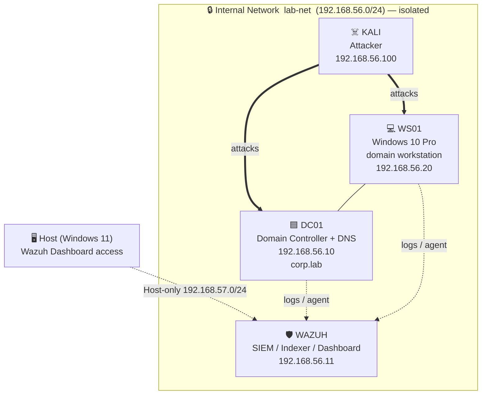

<h1 align="center">🛡️ Home SOC Lab</h1>

<p align="center">
  An isolated Active Directory environment with a Wazuh SIEM, built to practice
  <b>detection engineering</b> and <b>SOC L1 alert triage</b> against real attacks.
</p>

<p align="center">
  
  
  
  
  
</p>

---

## 📖 Overview

This project is a **fully isolated home lab** that simulates a small corporate
network and a Security Operations Center monitoring it. The goal is to practise
the day-to-day work of a SOC L1 analyst: generating realistic attacks from an
adversary machine, then **detecting, triaging and documenting** them in a SIEM.

Rather than maximising the number of machines, the lab is kept **intentionally
lean** so the focus stays on detection logic and analyst workflow — not on
managing infrastructure.

The environment is **air-gapped** from the internet. The attacker, the victims
and the SIEM communicate only on a private internal network, so attacks can be
run safely.

---

## 🗺️ Architecture



---

## 🧩 Components

| Host | Role | OS | IP (lab-net) |
| --- | --- | --- | --- |
| **DC01** | Domain Controller, DNS | Windows Server 2022 | `192.168.56.10` |
| **WAZUH** | SIEM (Indexer + Dashboard) | Wazuh OVA 4.14.5 | `192.168.56.11` |
| **WS01** | Domain-joined workstation | Windows 10 Pro 22H2 | `192.168.56.20` |
| **KALI** | Attacker | Kali Linux 2026.1 | `192.168.56.100` |

**Domain:** `corp.lab` &nbsp;|&nbsp; **NetBIOS:** `CORP`

The Wazuh server has a second interface on a **host-only network**
(`192.168.57.0/24`) so the dashboard can be reached from the host browser at
`https://192.168.57.11` — while the lab itself stays isolated from the internet.

---

## 🎯 What this lab demonstrates

- Building and securing an **Active Directory** domain from scratch
- Designing an **isolated, segmented network** for safe attack simulation
- Deploying and operating a **SIEM (Wazuh)** end to end
- **Detection engineering** — writing custom rules to catch attacker behaviour
- **SOC L1 triage** — turning raw alerts into structured incident reports
- Mapping activity to the **MITRE ATT&CK** framework

> ⚠️ **Note on credentials.** Test accounts in this lab use deliberately weak
> passwords (e.g. `Password123`). This is intentional — it lets attacks such as
> password spraying and Kerberoasting succeed so they can be detected. These are
> lab-only values and never represent real-world practice.

---

## 🧪 Attack & detection scenarios

Each scenario lives in its own folder under [`/attacks`](./attacks) and contains
the attacker commands, the raw evidence captured by Wazuh, the detection logic,
and a SOC-style incident report.

| # | Scenario | MITRE ATT&CK | Status |
| --- | --- | --- | --- |
| 01 | RDP / SMB brute force | T1110 | 🔜 planned |
| 02 | Kerberoasting | T1558.003 | 🔜 planned |
| 03 | Credential dumping (Mimikatz) | T1003 | 🔜 planned |
| 04 | Defender tampering | T1562.001 | 🔜 planned |
| 05 | Event log clearing | T1070.001 | 🔜 planned |
| 06 | Scheduled task persistence | T1053.005 | 🔜 planned |

*(Table will be updated as scenarios are documented.)*

---

## 📂 Repository structure

```
home-soc-lab/
├── README.md
├── docs/
│   ├── 01-architecture/      # network design, IP plan, isolation strategy
│   └── 02-setup/             # how each machine was built
├── attacks/                  # one folder per attack/detection scenario
├── wazuh-rules/              # custom Wazuh detection rules (XML)
├── sysmon-config/            # Sysmon configuration used on endpoints
├── incident-reports/         # SOC-style incident write-ups
└── screenshots/              # dashboard & evidence screenshots
```

---

## 🛠️ Built with

VirtualBox · Windows Server 2022 · Windows 10 Pro · Wazuh 4.14.5 · Kali Linux ·
Sysmon · MITRE ATT&CK

---

<p align="center"><sub>Built and documented as a hands-on cybersecurity portfolio project.</sub></p>
