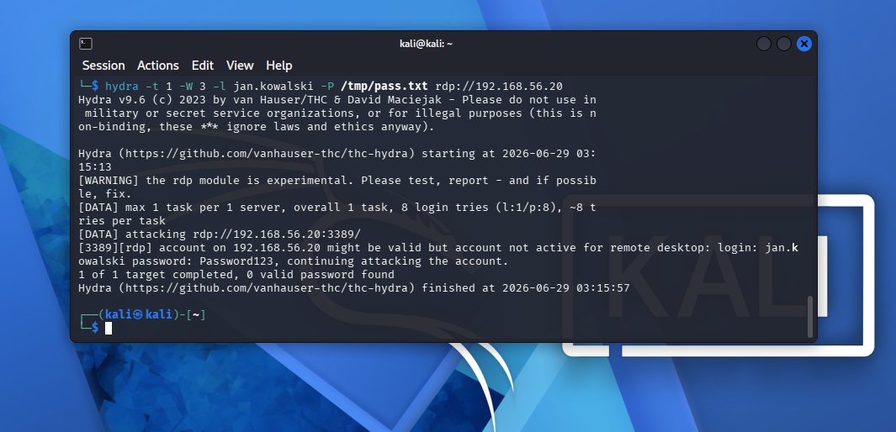
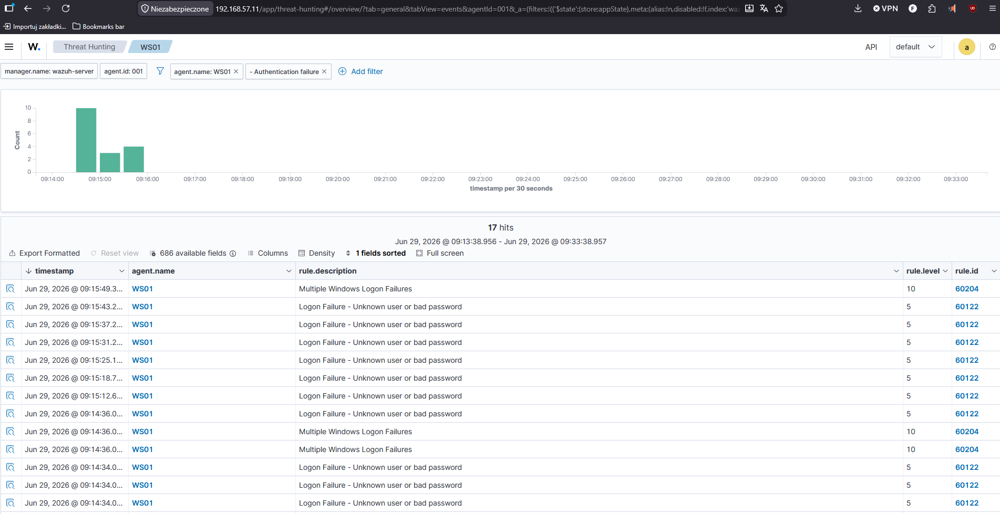
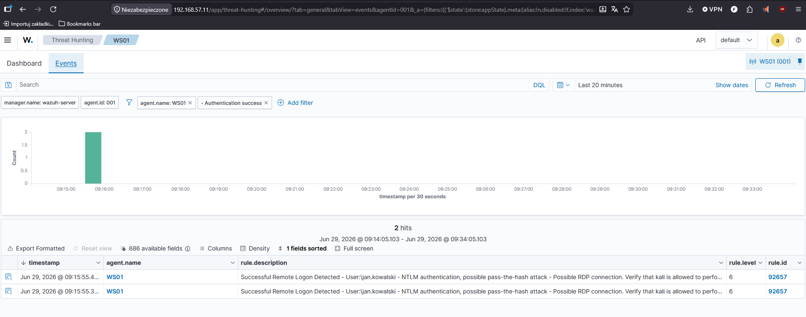
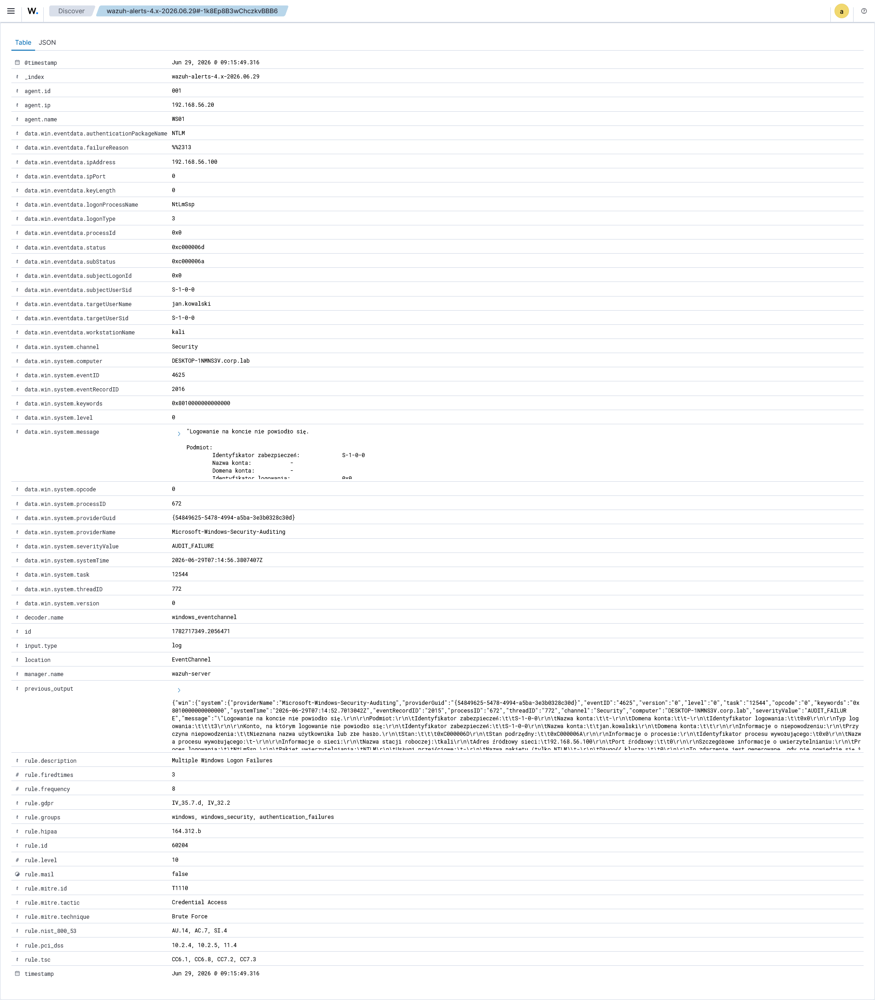

# Scenario 01 — RDP Brute Force → Successful Logon

> **MITRE ATT&CK:** [T1110.001 — Brute Force: Password Guessing](https://attack.mitre.org/techniques/T1110/001/)
> **Tactic:** Credential Access
> **Target:** WS01 (192.168.56.20) — Windows 10 Pro, domain member
> **Attacker:** KALI (192.168.56.100)
> **Account targeted:** `jan.kowalski` (CORP domain user)

---

## 1. Summary

An attacker on the internal network ran a password-guessing attack against the
Remote Desktop (RDP) service on WS01, trying a list of common passwords for the
domain user `jan.kowalski`. After several failed attempts the correct password
was found. Wazuh detected both the **burst of failed logons** (the brute-force
pattern) and the **successful logon that followed**, flagging the latter as a
possible compromise.

This is a textbook brute-force-to-compromise chain — exactly the kind of activity
a SOC L1 analyst triages every day.

---

## 2. Attack (from Kali)

A small, targeted wordlist was used for a clean, fast demonstration. The
detection logic is identical regardless of wordlist size — the SIEM triggers on
the *pattern* of repeated failed logons, not on the specific passwords.

> Kali also ships with `/usr/share/wordlists/rockyou.txt` (~14M passwords from a
> real breach). A real adversary would use that or a larger list; the resulting
> detection in Wazuh is the same.

**Recon — confirm the RDP port is open:**

```bash
nmap -p 3389 192.168.56.20
# 3389/tcp open ms-wbt-server
```

**Build the wordlist** (last entry is the account's real password, so the attack
"lands"):

```bash
echo -e "password\n123456\nadmin\nqwerty\nletmein\nWelcome1\nPassword1\nPassword123" > /tmp/pass.txt
```

**Run the brute force** (`-t 1 -W 3` keeps the experimental RDP module stable):

```bash
hydra -t 1 -W 3 -l jan.kowalski -P /tmp/pass.txt rdp://192.168.56.20
```

**Result:** hydra confirmed the valid credentials:

```
[3389][rdp] account on 192.168.56.20 might be valid ...
login: jan.kowalski  password: Password123
```

**The attack — hydra brute force from Kali:**



*The full hydra run — 8 attempts ending with the valid credentials `jan.kowalski : Password123`.*

---

## 3. What it looks like in the logs

Every failed attempt produced a **Windows Event ID 4625** (failed logon) on WS01.
The Wazuh agent forwarded these to the manager, which correlated them.

| Wazuh Rule | Description | Level |
| --- | --- | --- |
| **60122** | Logon Failure — Unknown user or bad password | 5 |
| **60204** | **Multiple Windows Logon Failures** (brute-force pattern) | 10 |
| **92657** | Successful Remote Logon — NTLM, possible pass-the-hash / RDP | 6 |

- **17** authentication failures were recorded in the 15-minute window.
- Rule **60204** is the key detection: Wazuh **correlated** the individual
  failures into a single "multiple failures" alert — i.e. it recognised the
  brute-force *pattern*, not just isolated errors.
- Rule **92657** fired on the successful logon that followed the failures, and
  even attributed the source to the attacker host (`kali`).

**Failed logons detected in Wazuh (rules 60122 + 60204):**



*Wazuh Threat Hunting — the burst of failed logons on WS01. Rule 60204 correlates them into a brute-force alert (level 10).*

**The compromise — successful logon flagged by Wazuh (rule 92657):**



*Rule 92657 fires on the successful NTLM logon following the failures — flagged as a possible compromise, with the source attributed to `kali`.*

**Raw alert detail (Event ID 4625):**



*Expanded alert showing the raw Windows event — Event ID 4625, target user, and source IP.*

---

## 4. Detection logic

This scenario is caught entirely by **Wazuh's built-in ruleset** — no custom rule
was needed, which is itself worth noting: out-of-the-box Wazuh already correlates
Windows logon failures into a brute-force alert.

The chain works because:

1. **Audit policy** on WS01 was enabled for logon success *and* failure, so every
   attempt writes Event ID 4625:
   ```powershell
   auditpol /set /subcategory:"Logon" /failure:enable /success:enable
   ```
2. The **Wazuh agent** ships those Windows Security events to the manager.
3. Rule **60122** matches each individual 4625.
4. Rule **60204** is a **frequency/correlation rule** — when enough 60122 events
   fire from the same source in a short window, it escalates to level 10.

### Optional hardening of the detection

A custom rule could lower the threshold or raise the severity for RDP-specific
brute force. Example of how a custom rule would look (stored in
[`/wazuh-rules`](../../wazuh-rules)):

```xml
<group name="local,authentication_failures,">
  <rule id="100001" level="12" frequency="8" timeframe="120">
    <if_matched_sid>60122</if_matched_sid>
    <same_source_ip />
    <description>RDP brute force: 8+ failed logons from same source in 2 min</description>
    <mitre>
      <id>T1110.001</id>
    </mitre>
  </rule>
</group>
```

---

## 5. Incident report (SOC L1 view)

| Field | Value |
| --- | --- |
| **Incident ID** | INC-2026-001 |
| **Severity** | High (successful logon after brute force) |
| **Detection time** | 2026-06-29 ~09:14–09:16 UTC |
| **Affected asset** | WS01 (192.168.56.20) |
| **Source / attacker** | KALI (192.168.56.100) |
| **Account** | CORP\jan.kowalski |
| **Triggered rules** | 60122, 60204, 92657 |
| **Indicators (IoCs)** | Source IP 192.168.56.100; 17× Event ID 4625; successful 4624 (NTLM) immediately after failures |

**What happened:** A host on the internal network performed ~17 failed logon
attempts against `jan.kowalski` on WS01 over ~2 minutes, immediately followed by
a successful NTLM logon — a strong indicator of a successful brute-force
compromise.

**Recommended actions (L1 → L2):**

1. **Reset the password** for `CORP\jan.kowalski` and force re-authentication.
2. **Isolate WS01** pending investigation (confirm no follow-on activity).
3. **Block / investigate** source 192.168.56.100.
4. Review whether `jan.kowalski` should have RDP access at all (least privilege).
5. Escalate to L2 if any post-logon activity (new processes, lateral movement).

---

## 6. Lessons learned (defender's view)

- **Weak passwords are the root cause.** `Password123` fell in 8 guesses.
  Enforce a strong password policy and account lockout (e.g. lock after 5 failed
  attempts) — lockout alone would have stopped this attack.
- **Restrict RDP exposure** — limit which accounts can use RDP, require Network
  Level Authentication, and never expose RDP broadly.
- **Account lockout policy** would convert this from a compromise into a
  (still-detected) denial of one account — a much better outcome.
- **The detection worked out of the box**, but tuning a custom rule (Section 4)
  lets the SOC alert faster and with clearer severity.

---

<p align="center"><sub>Part of <a href="../../README.md">home-soc-lab</a> — attack &amp; detection scenarios.</sub></p>
