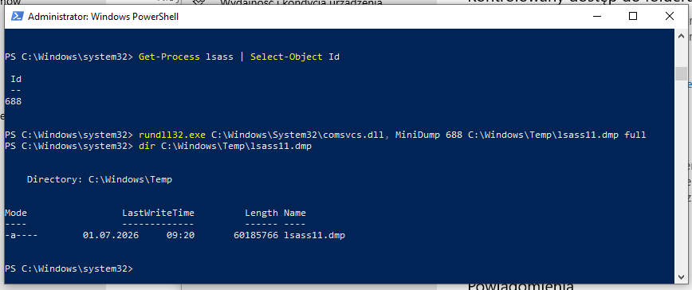
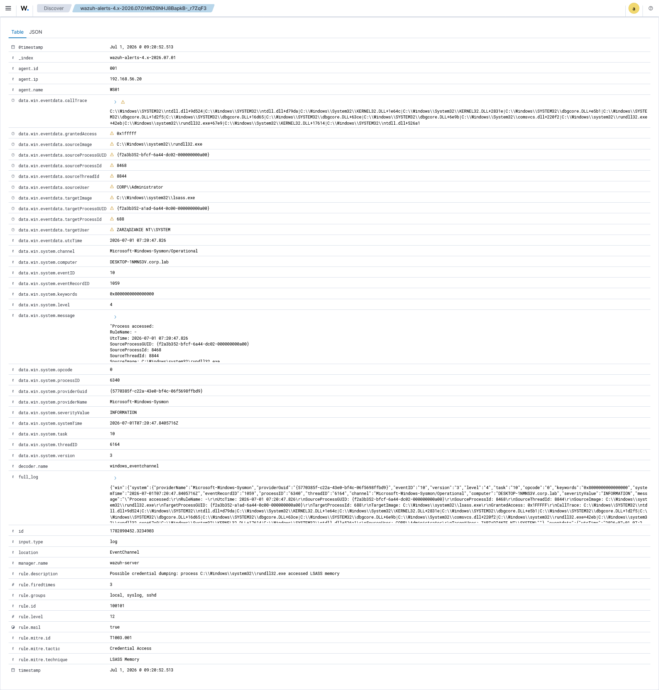
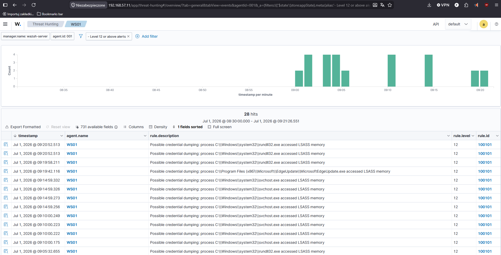
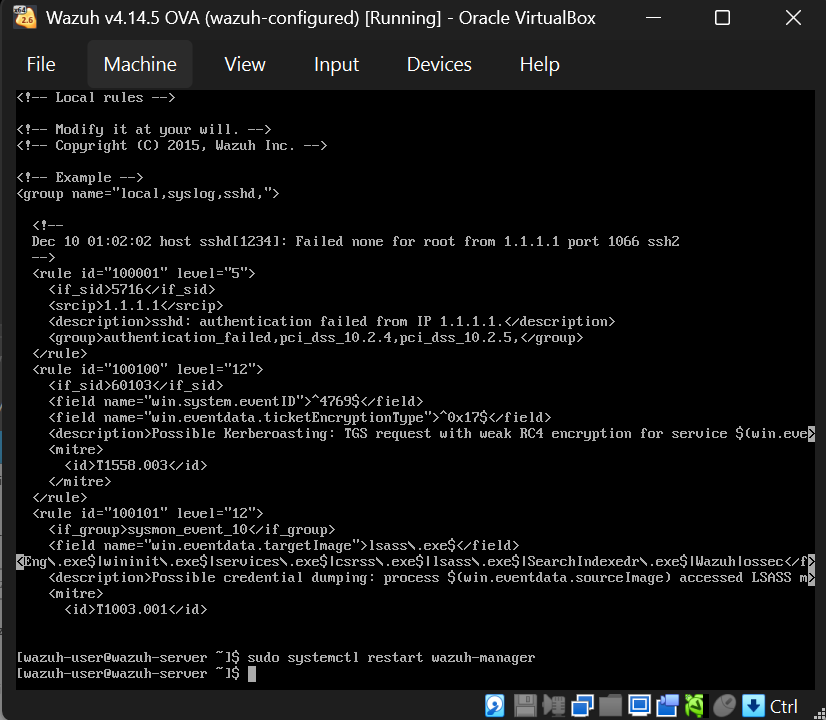

# Scenario 03 — Credential Dumping (LSASS Memory) → Sysmon Detection → Rule Tuning

> **MITRE ATT&CK:** [T1003.001 — OS Credential Dumping: LSASS Memory](https://attack.mitre.org/techniques/T1003/001/)
> **Tactic:** Credential Access
> **Target:** WS01 (192.168.56.20) — Windows 10 Pro
> **Technique:** LSASS memory dump via `comsvcs.dll` (living-off-the-land)
> **Detection stack:** Sysmon (Event ID 10) + Wazuh custom rule

---

## 1. Summary

After gaining local admin on a host, an attacker's next move is often to dump the
memory of **LSASS** (Local Security Authority Subsystem Service) — the process
that holds credentials, hashes and Kerberos tickets in memory. With that dump
they can extract secrets offline and move laterally.

This scenario dumps LSASS using **only built-in Windows tooling** (`rundll32` +
`comsvcs.dll`) — a "living-off-the-land" technique that avoids dropping known
tools like Mimikatz. The access to LSASS is caught by **Sysmon Event ID 10**, and
a **custom Wazuh rule** was written and then **tuned against false positives** —
which is where most of the real SOC learning in this scenario happened.

---

## 2. Prerequisites — telemetry setup

Detecting this attack needs more than default Windows logging. Two things were set
up on WS01 first:

### Sysmon with LSASS ProcessAccess logging

Sysmon was installed and configured to log **ProcessAccess (Event ID 10)** for
`lsass.exe`. This is important: popular Sysmon configs (e.g. SwiftOnSecurity)
heavily filter ProcessAccess to reduce noise, so a targeted rule was applied:

```xml
<Sysmon schemaversion="4.50">
  <EventFiltering>
    <RuleGroup name="" groupRelation="or">
      <ProcessAccess onmatch="include">
        <TargetImage condition="image">lsass.exe</TargetImage>
      </ProcessAccess>
    </RuleGroup>
  </EventFiltering>
</Sysmon>
```

> 💡 **Lesson:** the default SwiftOnSecurity config logged **zero** Event 10 for
> LSASS (`Count : 0`). Without explicitly including `lsass.exe` in ProcessAccess,
> the attack is invisible. Knowing your telemetry actually captures what you think
> it does is half the job.

### Wazuh agent collecting the Sysmon channel

The agent's `ossec.conf` includes the Sysmon channel:

```xml
<localfile>
  <location>Microsoft-Windows-Sysmon/Operational</location>
  <log_format>eventchannel</log_format>
</localfile>
```

---

## 3. Attack (from WS01, as local admin)

### Find the LSASS process ID

```powershell
Get-Process lsass | Select-Object Id
# Id : 688
```

### Dump LSASS memory with comsvcs.dll

```powershell
rundll32.exe C:\Windows\System32\comsvcs.dll, MiniDump 688 C:\Windows\Temp\lsass.dmp full
```

This produced a **60 MB memory dump** of LSASS — which an attacker would exfiltrate
and parse offline (e.g. with Mimikatz or pypykatz) to extract credentials.

```powershell
dir C:\Windows\Temp\lsass.dmp
# -a----   01.07.2026   08:22   60333046 lsass.dmp
```



*The `rundll32 ... comsvcs.dll MiniDump` command produces a 60 MB `lsass.dmp` — a full memory dump of the credential store.*

### Note: Windows Defender actively fought this

On the first attempts, Defender **blocked** the dump (`Odmowa dostępu` / Access
denied) and flagged credential-dumping signatures. To complete the attack,
Defender's real-time protection **and Tamper Protection** had to be disabled
(Tamper Protection can only be turned off in the GUI — it blocks PowerShell
`Set-MpPreference`). This is itself an important observation: **prevention worked
before detection did**, and disabling Defender is a detectable event in its own
right (a future scenario — Defender tampering, T1562.001).

---

## 4. What it looks like in the logs

The dump triggers **Sysmon Event ID 10 (ProcessAccess)** on WS01. The raw event:

```
Process accessed:
  SourceImage:    C:\Windows\system32\rundll32.exe
  TargetImage:    C:\Windows\system32\lsass.exe
  GrantedAccess:  0x1FFFFF      <-- full access to LSASS memory
  SourceUser:     CORP\Administrator
  CallTrace:      ... comsvcs.dll+220f2 | rundll32.exe ...
```

The tell-tale signs:

| Field | Value | Why it matters |
| --- | --- | --- |
| `SourceImage` | rundll32.exe | LOLBin used to dump memory |
| `TargetImage` | lsass.exe | the credential store |
| `GrantedAccess` | **0x1FFFFF** | full access — classic dumping signature |
| `CallTrace` | contains `comsvcs.dll` | the exact dumping technique |



*The raw Sysmon Event 10: `rundll32.exe` → `lsass.exe`, `GrantedAccess: 0x1FFFFF`, with `comsvcs.dll` visible in the call trace.*

---

## 5. Detection logic — custom Wazuh rule (and the if_group lesson)

### First attempt — didn't fire

An initial rule based only on `<decoded_as>windows_eventchannel</decoded_as>`
matched in `wazuh-logtest` but **never fired on live events**. Reason: for Sysmon
Event 10, Wazuh matches its built-in Sysmon branch (`sysmon_event_10`, rule
92900), and a separate atomic `decoded_as` rule never gets evaluated on the real
event flow. This is a classic Wazuh pitfall.

### Working rule — inherit from the Sysmon parent group

The fix is to hang the rule off the correct parent using `<if_group>`:

```xml
<rule id="100101" level="12">
  <if_group>sysmon_event_10</if_group>
  <field name="win.eventdata.targetImage">lsass\.exe$</field>
  <field name="win.eventdata.sourceImage" negate="yes">svchost\.exe$|VBoxService\.exe$|MsMpEng\.exe$|wininit\.exe$|services\.exe$|csrss\.exe$|lsass\.exe$|SearchIndexer\.exe$</field>
  <description>Possible credential dumping: process $(win.eventdata.sourceImage) accessed LSASS memory</description>
  <mitre>
    <id>T1003.001</id>
  </mitre>
</rule>
```

With `if_group`, the `eventID` check is unnecessary — the group guarantees it's
Event 10. Stored in [`/wazuh-rules/local_rules.xml`](../../wazuh-rules/local_rules.xml).

The rule fired on the attack:

```
Rule 100101 (level 12):
Possible credential dumping: process C:\Windows\system32\rundll32.exe accessed LSASS memory
```



*The Wazuh alert (custom rule 100101, level 12) — `rundll32.exe` accessing LSASS memory, mapped to MITRE T1003.001.*

### Rule tuning — dealing with false positives

The first working version of the rule alerted on **every** process touching LSASS
— including legitimate Windows processes. In this lab that meant false positives
from `VBoxService.exe`, then `svchost.exe`, etc. Excluding them one by one is a
losing game — many legitimate processes access LSASS constantly.



*Before tuning: the rule fired on legitimate processes (VBoxService, svchost) too. The fix is a baseline exclusion, not chasing each one individually.*

The proper fix is a **baseline exclusion**: a `negate="yes"` list of known-good
processes, so the rule only alerts on the *unexpected* ones (like rundll32). This
is exactly how production Sysmon/SIEM configs handle LSASS access.

> 💡 **Lesson:** a detection rule isn't "done" when it fires — it's done when it
> fires on attacks and stays quiet on normal activity. Tuning against a baseline
> is core SOC work: high-fidelity alerts matter more than catching every event.

---

## 6. Incident report (SOC L1 view)

| Field | Value |
| --- | --- |
| **Incident ID** | INC-2026-003 |
| **Severity** | Critical (credential theft) |
| **Detection time** | 2026-07-01 ~09:01 UTC |
| **Affected asset** | WS01 (192.168.56.20) |
| **Process** | `rundll32.exe` (via comsvcs.dll MiniDump) |
| **Target** | `lsass.exe` (PID 688), GrantedAccess 0x1FFFFF |
| **Actor** | CORP\Administrator (local admin session) |
| **Triggered rules** | 100101 (custom), 92900 (built-in) |
| **Indicators (IoCs)** | rundll32 accessing lsass with 0x1FFFFF; comsvcs.dll in call trace; lsass.dmp (~60 MB) in C:\Windows\Temp |

**What happened:** A process used the built-in `comsvcs.dll` MiniDump function to
dump LSASS memory — a credential-theft technique. Defender initially blocked it;
the attack only succeeded after Defender protections (incl. Tamper Protection)
were disabled, which is itself suspicious activity.

**Recommended actions (L1 → L2):**

1. **Isolate WS01** — LSASS was dumped; treat all credentials on it as compromised.
2. **Force password resets** for accounts that authenticated to WS01 recently.
3. Investigate **why Defender was disabled** — no legitimate admin task requires it.
4. Locate and remove the dump file; check for exfiltration.
5. Escalate to L2 — LSASS dumping is a precursor to lateral movement.

---

## 7. Lessons learned (defender's view)

- **Enable LSASS protection.** `RunAsPPL` (Protected Process Light) makes LSASS
  much harder to access, even for admins. Credential Guard is stronger still.
- **Watch for Defender being disabled.** Turning off protection is a high-signal
  event — alert on it (Scenario 04).
- **`comsvcs.dll` MiniDump is a known LOLBin** — hunt for `rundll32` +
  `comsvcs.dll` + `MiniDump` in command lines and call traces.
- **Telemetry must be verified.** Default Sysmon configs don't log LSASS access;
  the rule is worthless if the event never reaches the SIEM.
- **Detections need tuning.** A rule that fires on everything is noise; baseline
  exclusions turn it into a high-fidelity alert.

---

<p align="center"><sub>Part of <a href="../../README.md">home-soc-lab</a> — attack &amp; detection scenarios.</sub></p>
