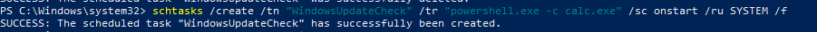
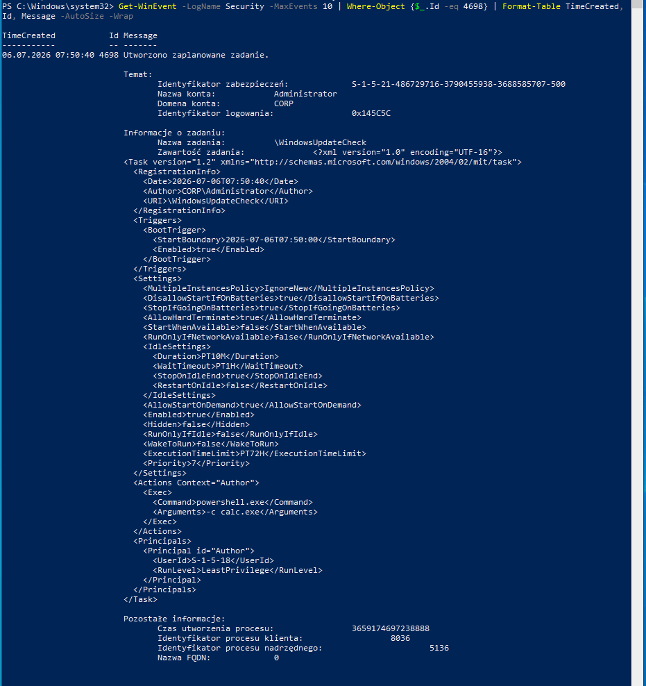
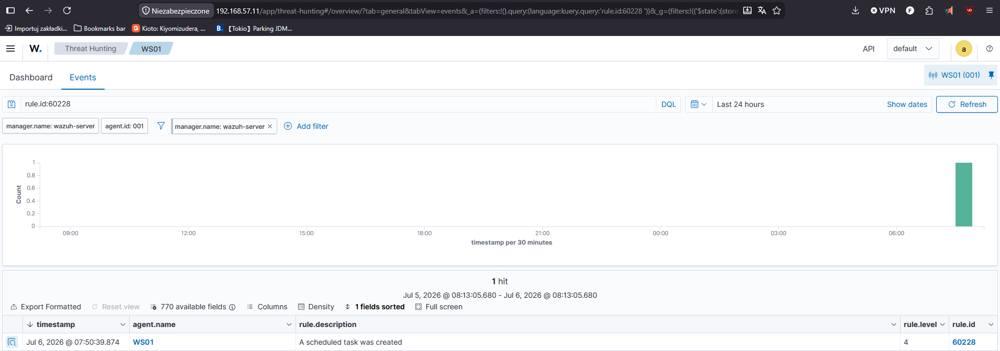
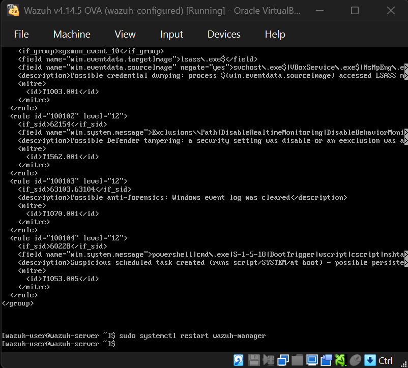
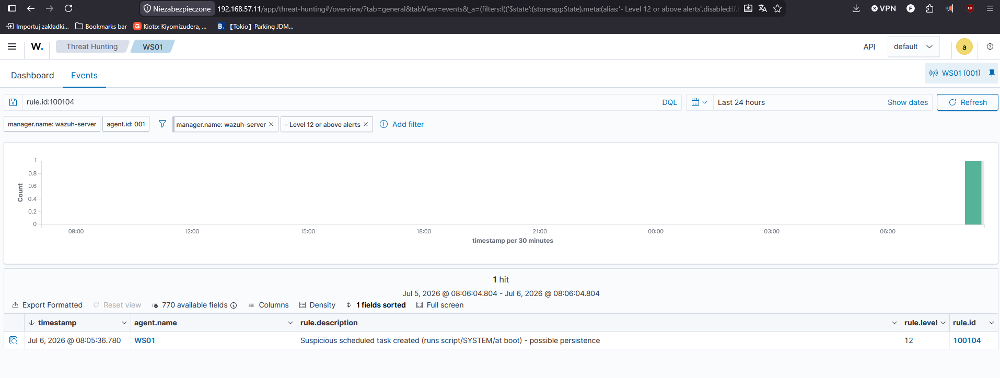

# Scenario 06 — Scheduled Task Persistence → Custom Detection Rule

> **MITRE ATT&CK:** [T1053.005 — Scheduled Task/Job: Scheduled Task](https://attack.mitre.org/techniques/T1053/005/)
> **Tactic:** Persistence (also Privilege Escalation / Execution)
> **Target:** WS01 (192.168.56.20) — Windows 10 Pro
> **Detection stack:** Windows Security log (Event 4698) + Wazuh custom rule

---

## 1. Summary

Getting into a machine is only half the battle for an attacker — they also need to
**survive a reboot or logoff**. One of the most common ways to do that is a
**scheduled task**: register a task that re-launches the attacker's code at boot,
at logon, or on a timer. This is "persistence".

This scenario creates a malicious scheduled task disguised as a Windows update
check, running at every system start as SYSTEM, and detects it. Windows logs task
creation as **Event ID 4698**, and a **custom Wazuh rule** raises the severity when
the task looks malicious (runs a script, runs as SYSTEM, or triggers at boot).

This is the final scenario in the lab, and it completes the attack chain:
initial access → credential theft → defense evasion → anti-forensics →
**persistence**.

---

## 2. Prerequisites — enable task-creation auditing

Event 4698 requires the "Other Object Access Events" audit subcategory. Enabled on
WS01 via its GUID (language-independent — this host runs Polish Windows):

```powershell
auditpol /set /subcategory:"{0CCE9227-69AE-11D9-BED3-505054503030}" /success:enable /failure:enable
```

> 💡 On a localized Windows, the English subcategory name fails
> (`Error 0x00000057 — the parameter is incorrect`). Using the **GUID** works
> regardless of system language — a handy trick for any audit subcategory.

---

## 3. Attack (from WS01, as admin)

Create a scheduled task that runs at every boot, as SYSTEM, disguised with a
legitimate-sounding name:

```powershell
schtasks /create /tn "WindowsUpdateCheck" /tr "powershell.exe -c calc.exe" /sc onstart /ru SYSTEM /f
```

| Flag | Value | Attacker intent |
| --- | --- | --- |
| `/tn` | `WindowsUpdateCheck` | a **legit-sounding name** to blend in |
| `/tr` | `powershell.exe -c calc.exe` | the payload (here a harmless calc; a real attacker would launch malware) |
| `/sc onstart` | at every boot | **persistence** — survives reboots |
| `/ru SYSTEM` | run as SYSTEM | **highest privilege** |

Confirm it was created:

```powershell
schtasks /query /tn "WindowsUpdateCheck"
# WindowsUpdateCheck    N/A    Ready
```



*`schtasks /create` registers the boot-persistent task as SYSTEM; `schtasks /query` confirms it is Ready.*

---

## 4. What it looks like in the logs

Task creation writes **Event ID 4698** to the Security log, including the full task
definition in XML. The revealing parts:

```xml
<Author>CORP\Administrator</Author>
<Triggers>
  <BootTrigger>...</BootTrigger>          <!-- runs at every boot -->
</Triggers>
<Actions>
  <Exec>
    <Command>powershell.exe</Command>      <!-- launches a script host -->
    <Arguments>-c calc.exe</Arguments>
  </Exec>
</Actions>
<Principals>
  <Principal>
    <UserId>S-1-5-18</UserId>              <!-- SYSTEM -->
  </Principal>
</Principals>
```

Three red flags in one task: **BootTrigger** (persistence), **powershell.exe**
(script execution), and **S-1-5-18** (SYSTEM). Any one is suspicious; all three
together is a textbook persistence mechanism.



*The raw Event 4698 — the full task XML showing the BootTrigger, the powershell.exe command, and the SYSTEM (S-1-5-18) principal.*

---

## 5. Detection — built-in rule (level 4) → custom rule (level 12)

### Out of the box

Wazuh detects task creation with built-in rule **60228** ("A scheduled task was
created") — but at **level 4**. Since tasks are created legitimately all the time
(Windows, installers, updaters), level 4 is appropriate for the *generic* event
but far too low for a *malicious* one.



*The built-in alert 60228 fires on the task creation — but only at level 4 (informational).*

### Custom rule — escalate suspicious tasks

A custom rule inherits from 60228 and raises the severity to **level 12** when the
task contains hallmarks of a malicious one — a script host, SYSTEM, or a boot
trigger. Stored in [`/wazuh-rules/local_rules.xml`](../../wazuh-rules/local_rules.xml):

```xml
<rule id="100104" level="12">
  <if_sid>60228</if_sid>
  <field name="win.system.message">powershell|cmd\.exe|S-1-5-18|BootTrigger|wscript|cscript|mshta|rundll32</field>
  <description>Suspicious scheduled task created (runs script/SYSTEM/at boot) - possible persistence</description>
  <mitre>
    <id>T1053.005</id>
  </mitre>
</rule>
```



*The custom rule 100104 — inherits from built-in rule 60228 and escalates suspicious tasks to level 12.*

The rule fired on the malicious task:

```
Rule 100104 (level 12):
Suspicious scheduled task created (runs script/SYSTEM/at boot) - possible persistence
```



*The custom alert 100104 (level 12) for the suspicious scheduled task, mapped to T1053.005.*

This keeps benign task creation quiet (level 4) while promoting genuinely
suspicious tasks to a high-priority alert — the same severity-tuning approach used
throughout this lab.

---

## 6. Incident report (SOC L1 view)

| Field | Value |
| --- | --- |
| **Incident ID** | INC-2026-006 |
| **Severity** | High |
| **Detection time** | 2026-07-06 ~08:05 UTC |
| **Affected asset** | WS01 (192.168.56.20) |
| **Actor** | CORP\Administrator |
| **Task** | `WindowsUpdateCheck` — runs `powershell.exe -c calc.exe` at boot as SYSTEM |
| **Triggered rules** | 100104 (custom, level 12); 60228 (built-in, level 4) |
| **Indicators (IoCs)** | Event 4698; task name `WindowsUpdateCheck`; BootTrigger; principal S-1-5-18 (SYSTEM); powershell.exe action |

**What happened:** A scheduled task disguised with a legitimate-sounding name was
created to run PowerShell at every boot as SYSTEM — a persistence mechanism giving
the attacker code execution that survives reboots, at the highest privilege.

**Recommended actions (L1 → L2):**

1. **Disable and delete the task** (`schtasks /delete /tn WindowsUpdateCheck /f`)
   after preserving its definition for evidence.
2. **Investigate the payload** the task runs — here it's calc, but treat the real
   command as malicious until proven otherwise.
3. Correlate with earlier activity on WS01 — persistence is a late-stage action,
   so look for the initial access and privilege escalation that preceded it.
4. Verify no other persistence exists (Run keys, services, WMI subscriptions).
5. Escalate to L2 / IR — a SYSTEM-level boot persistence is a serious finding.

---

## 7. Lessons learned (defender's view)

- **Legit-sounding names are a tell, not a defense.** "WindowsUpdateCheck" is
  meant to blend in — don't trust task names; inspect what they actually run.
- **Alert on the combination.** Script host + SYSTEM + boot trigger is a strong
  signal; scoring on those hallmarks separates malicious tasks from routine ones.
- **Persistence is a late-stage action.** Finding it means the attacker was
  already in — always look backwards for the rest of the chain.
- **Audit task creation.** Event 4698 isn't logged without the right audit
  subcategory enabled; verify the telemetry exists.
- **Enumerate all persistence locations** during IR — scheduled tasks are one of
  many (Run keys, services, startup folder, WMI).

---

<p align="center"><sub>Part of <a href="../../README.md">home-soc-lab</a> — attack &amp; detection scenarios.</sub></p>
